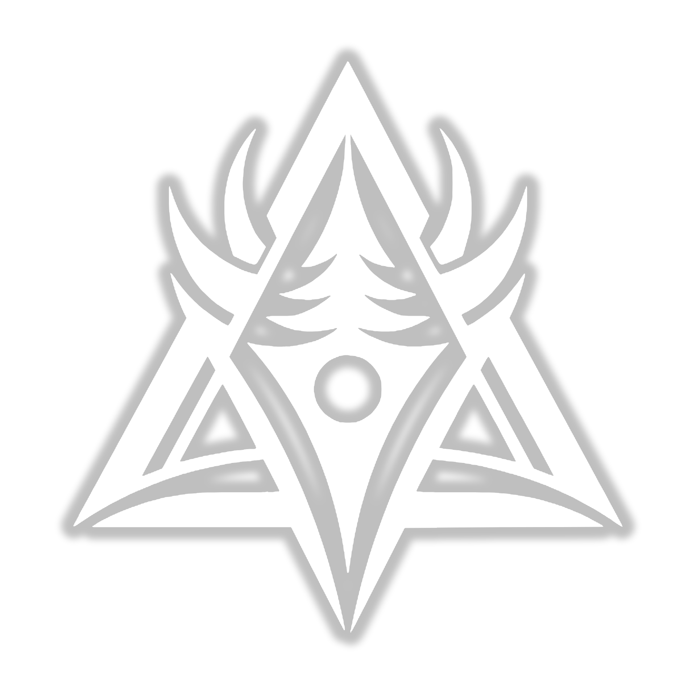

<!-- Replace this placeholder with your actual logo -->

# Vaelthar

**Open-Source Voxel Game Engine & Multiplayer Framework**

Building the foundation for next-generation block-based experiences

---

## About Vaelthar

Vaelthar is an open-source organization dedicated to developing high-performance voxel game technology. Our mission is to create a complete, extensible ecosystem for building multiplayer block-based games and experiences that run seamlessly in modern web browsers.

The project combines cutting-edge web technologies with proven game engine architecture to deliver a developer-friendly platform that doesn't compromise on performance or features.

### Core Philosophy

**Performance First** – Optimized chunk-based rendering and physics designed for real-time multiplayer experiences  
**Developer Experience** – TypeScript-native with comprehensive type safety and modern tooling  
**Extensibility** – Plugin architecture and modular design for easy customization  
**Open Collaboration** – Community-driven development with transparent processes

---

## Our Vision

We're building the future of voxel game technology with a focus on:

**Modern Web Standards** – Leveraging the latest browser capabilities for high-performance 3D experiences  
**Scalable Architecture** – Designing systems that work from small prototypes to massive multiplayer worlds  
**Developer Tools** – Creating libraries and frameworks that make voxel game development accessible  
**Community Growth** – Fostering an ecosystem where developers can share, learn, and build together

---

## Technology Focus

We're exploring and developing open-source solutions in:

**Rendering & Graphics**
- Efficient chunk-based voxel rendering
- WebGL optimization techniques
- Dynamic level-of-detail systems

**Physics & Collision**
- AABB-based collision detection
- Rigid body dynamics for voxel worlds
- Performance-optimized spatial queries

**Networking & Protocol**
- Binary serialization strategies
- Client-server synchronization
- Scalable multiplayer architecture

**Developer Tooling**
- Type-safe APIs with TypeScript
- Modular, reusable libraries
- Comprehensive documentation

---

## Getting Involved

Vaelthar is an open-source project, and we welcome contributions from developers of all skill levels. Whether you're interested in game engine development, graphics programming, networking, or documentation, there's a place for you here.

### Ways to Contribute

**Code Contributions** – Submit bug fixes, features, or optimizations  
**Documentation** – Improve guides, API docs, or tutorials  
**Testing** – Report bugs and test new features  
**Community** – Help others in discussions and share your projects

Visit our [Contributing Guide](https://github.com/vaelthar/.github/blob/main/CONTRIBUTING.md) to get started.

---

## Connect With Us

<!-- Social Links with Badge Icons -->

### Community Resources

- **[Organization Discussions](https://github.com/orgs/vaelthar/discussions)** – Ask questions and share ideas
- **[Repositories](https://github.com/orgs/vaelthar/repositories)** – Explore our open-source projects
- **[Documentation](https://docs.vaelthar.dev)** – Guides and API references

---

## License

All Vaelthar projects are licensed under the **MIT License**, promoting open collaboration and allowing both commercial and non-commercial use. See individual repository LICENSE files for details.

---

**Building the future of voxel gaming, one block at a time.**

*Star our repositories to support the project*

